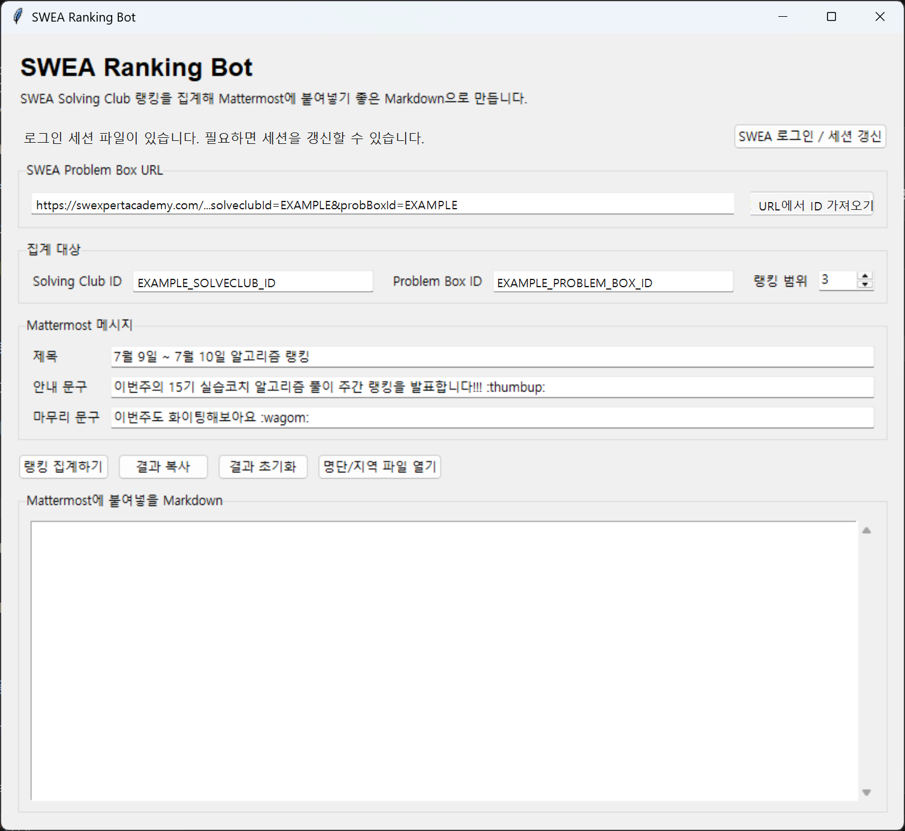
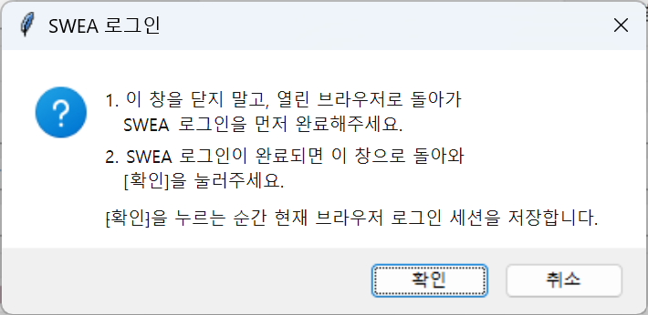
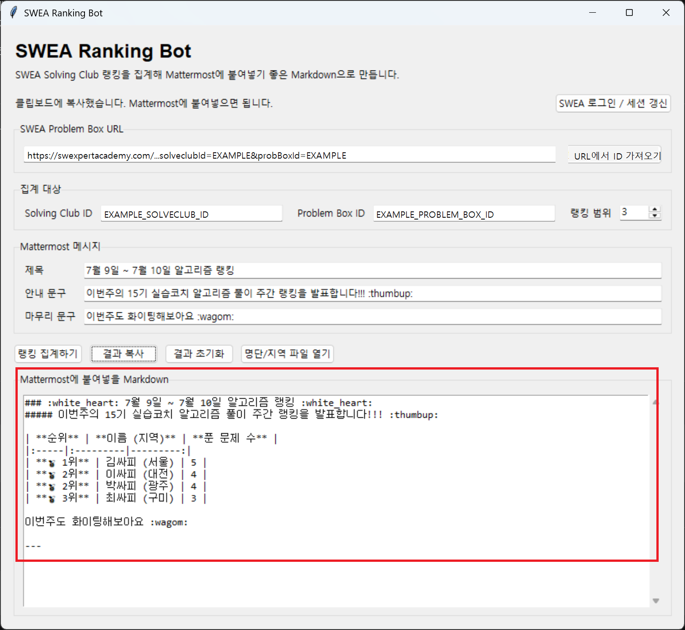

# SWEA Ranking Bot

[SW Expert Academy](https://swexpertacademy.com) Solving Club의 Problem Box 제출현황을 스크래핑해서, 클럽 멤버별 주간 Pass 문제 수 랭킹을 Mattermost에 공유하기 좋은 Markdown 표로 만들어주는 GUI 도구.

스터디나 사내/교육 코호트에서 SWEA Solving Club을 돌리고 있는데, "누가 이번 주에 몇 문제 풀었는지"를 매번 수동으로 확인하기 번거로운 경우에 쓰기 위해 만들었다. Windows에서는 exe를 실행해 버튼 GUI로 사용할 수 있고, 필요하면 CLI로도 같은 집계를 실행할 수 있다. Problem Box 하나(예: 그 주에 등록한 문제들)를 지정하면, 멤버별 제출 결과를 펼쳐서 Pass한 문제 수를 집계하고 Mattermost 공지에 붙여넣기 좋은 Markdown 랭킹 표로 출력한다.

## 사용 시나리오

예를 들어 매주 SWEA Solving Club에 알고리즘 Problem Box를 만들고, 주간 풀이 결과를 Mattermost 채널에 공유하는 흐름에서 사용할 수 있다.

1. SWEA Solving Club에 이번 주 Problem Box를 만든다.
2. 주간 풀이가 끝나면 이 도구로 멤버별 Pass 문제 수를 집계한다.
3. 출력된 Markdown 표를 Mattermost 공지 메시지에 붙여넣어 랭킹을 공유한다.

이 도구는 Mattermost에 직접 메시지를 전송하지 않는다. 현재는 Mattermost에서 표로 렌더링되기 좋은 Markdown을 생성하는 데 집중한다.

## Windows에서 바로 사용하기

GitHub Releases에서 `SWEA Ranking Bot.zip`을 내려받아 압축을 푼 뒤, `SWEA Ranking Bot.exe`를 실행한다.

압축을 푼 폴더 안의 파일들은 함께 있어야 한다. Playwright 브라우저 파일이 포함되어 있으므로 `SWEA Ranking Bot.exe`만 따로 빼서 실행하지 않는 것을 권장한다.

## GUI 사용법

Releases에서 받은 Windows 배포본을 사용한다면 `SWEA Ranking Bot.exe`를 실행하면 된다.

1. [SWEA 로그인 / 세션 갱신]을 눌러 SWEA에 로그인한다.
2. SWEA Problem Box URL을 붙여넣고 [URL에서 ID 가져오기]를 누른다.
3. 지역 표기가 필요하면 [명단/지역 파일 열기]를 눌러 `roster.json`을 수정한다.
4. [랭킹 집계하기]를 눌러 결과를 만든다.
5. 필요한 문구를 편집한 뒤 [결과 복사]를 눌러 Mattermost에 붙여넣는다.

Problem Box 상세 페이지나 제출현황 페이지 URL을 그대로 붙여넣으면 `solveclubId`, `probBoxId`를 자동으로 채운다.

```
https://swexpertacademy.com/main/talk/solvingClub/problemBoxDetail.do?solveclubId=...&probBoxId=...
https://swexpertacademy.com/main/talk/solvingClub/problemBoxSubmitStatusList.do?solveclubId=...&probBoxId=...
```

GUI의 로그인 세션과 최근 입력값은 저장소 폴더가 아니라 `%APPDATA%\swea-ranking-bot`에 저장된다.

roster(닉네임→지역 매핑)는 GUI/CLI 공통으로 같은 파일을 본다 — 스크립트로 실행하면 이 폴더의 `roster.json`, exe로 빌드했으면 **exe 파일과 같은 폴더**의 `roster.json`. GUI의 [명단/지역 파일 열기] 버튼을 누르면 파일이 없을 때 예시를 자동 생성하고, 있으면 바로 편집할 수 있게 연다. 자세한 작성법은 [표시 이름 / 지역 표기](#표시-이름--지역-표기) 참고.

## 스크린샷

아래 스크린샷은 GUI 사용 흐름과 Mattermost에 붙여넣을 Markdown 출력 예시를 보여준다.

### GUI 메인 화면



### SWEA 로그인 안내



### 출력 예시



## 소스에서 실행하기

Python 3.10 이상을 권장한다.

```
pip install -r requirements.txt
python -m playwright install chromium
python swea_ranking_gui.py
```

## CLI 사용법

```
python swea_ranking_bot.py --login
python swea_ranking_bot.py --solveclub-id <Solving Club ID> --prob-box-id <Problem Box ID> --nickname <닉네임>   # 개별 테스트
python swea_ranking_bot.py --solveclub-id <Solving Club ID> --prob-box-id <Problem Box ID>                        # 전체 집계
```

`--login`은 최초 1회(또는 세션 만료 시) 실행 — 브라우저가 뜨면 SWEA에 로그인 후 터미널에서 Enter.
로그인 세션은 `swea_auth.json`에 저장되며 `.gitignore`로 제외되어 커밋되지 않는다. SWEA 비밀번호는 어디에도 저장하지 않는다.

`--solveclub-id`, `--prob-box-id`는 해당 Solving Club/Problem Box 페이지 URL의 쿼리 파라미터에서 확인할 수 있다
(`.../problemBoxSubmitStatusList.do?solveclubId=...&probBoxId=...`).

### 표시 이름 / 지역 표기

랭킹 표의 제목 행은 항상 `이름 (지역)`으로 표시한다.

SWEA 닉네임은 보통 `이름_학번`(예: `김싸피_1234567`) 형식이다. `roster.json`에 닉네임→지역 매핑이 있으면 `_학번` 부분을 잘라 `이름 (지역)`으로 표시한다. 매칭이 없으면 동명이인 구분을 위해 원본 닉네임(`이름_학번`)을 그대로 표시한다.

지역까지 함께 표시하고 싶다면 `roster.json` 파일을 만들어 닉네임→지역 매핑을 넣으면 된다. `roster.example.json`을 복사해서 시작하면 된다:

```
cp roster.example.json roster.json
```

```json
{
  "김싸피_1234567": "구미",
  "이싸피_2345678": "서울",
  "박싸피_3456789": "광주"
}
```

`roster.json`은 실제 인원 정보(개인정보)가 들어가므로 `.gitignore`에 포함되어 있어 커밋되지 않는다. 파일이 없거나 매칭되지 않은 닉네임은 원본 닉네임 그대로 표시된다. `--roster-file`로 다른 경로를 지정할 수도 있다(기수가 바뀌면 새 roster 파일로 교체).

## 개발자 / 배포자용 Windows exe 빌드

이 섹션은 일반 사용자가 아니라, 소스에서 직접 exe를 만들거나 새 릴리스를 배포하는 사람을 위한 내용이다.

릴리즈용 exe는 PyInstaller로 만들 수 있다. Playwright 브라우저 의존성이 있어 단일 exe보다 폴더 배포를 권장한다. 아래 명령은 PowerShell 기준이다.

```
pip install pyinstaller
.\scripts\build_windows.ps1 -DistPath dist
```

빌드가 끝나면 `dist/SWEA Ranking Bot/` 폴더를 zip으로 묶어 GitHub Releases에 첨부한다.

`python`이 PATH에 없다면 Python 실행 파일을 직접 지정할 수 있다.

```
.\scripts\build_windows.ps1 -Python C:\Path\To\python.exe -DistPath dist
```

## 출력 예시

Mattermost에 붙여넣는 발표 형식은 아래와 같다.

```
### :white_heart: M월 D일 ~ M월 D일 알고리즘 랭킹 :white_heart:

##### 이번주의 15기 실습코치 알고리즘 풀이 주간 랭킹을 발표합니다!!! :thumbup:

| **순위** | **이름 (지역)** | **푼 문제 수** |
|:-----|:---------|---------:|
| **🥇 1위** | 김싸피 (구미) | 5 |
| **🥈 2위** | 이싸피 (서울) | 4 |
| **🥉 3위** | 박싸피 (광주) | 1 |

이번주도 화이팅해보아요 :wagom:

---
```

## 동작 원리

로그인 세션을 재사용하는 헤드리스 Chromium(Playwright)으로 제출현황 페이지를 열고, 멤버별 행의 "상세보기"를 클릭해 펼쳐지는 제출 상세(문제번호, 결과)를 읽어 집계한다. 별도의 비공개 API를 호출하지 않고 실제 사용자가 클릭하는 흐름을 그대로 재현한다.

## 트러블슈팅

개발·운영 중 겪은 문제와 해결 방법을 기록한다. 새로운 이슈를 만나면 여기에 계속 추가할 것.

- **일반 SWEA 문제 링크로 풀면 집계에 안 잡힘**: Problem Box에 등록된 문제여야 그 박스의 "제출현황"에 잡힌다. 공지에는 반드시 Problem Box 등록 후 생성되는 클럽 전용 링크(`talk/solvingClub/problemView.do?...probBoxId=...`)를 써야 한다. 일반 문제 링크(`code/problem/problemDetail.do`)로 풀면 Solving Club 제출현황에 반영되지 않는다.
- **로그인 세션이 만료되면 무한 대기**: 세션이 만료되면 페이지가 익명 로그인 페이지(`identity/anonymous/loginPage.do`)로 리다이렉트되는데, 이를 감지하는 로직이 없어 이후 셀렉터 대기가 타임아웃까지 계속 걸린다. `--login`을 다시 실행해 세션을 갱신하면 해결된다. (세션 만료 자동 감지는 아직 구현 안 됨 — TODO)
- **페이지네이션이 무한 루프에 빠질 뻔함**: 처음엔 "Next" 버튼의 visibility/class를 보고 마지막 페이지를 판단했는데 이 방식이 불안정했다. 지금은 `row_count < PAGE_SIZE`(한 페이지에 표시되는 행 수가 페이지 크기보다 적으면 마지막 페이지)로 판단하고, 추가로 `MAX_PAGES` 상한과 `page.set_default_timeout(15000)`을 둬서 어떤 경우든 무한정 멈춰있지 않도록 안전장치를 걸었다.
- **랭킹 표에 메달 이모지가 들어가면 Windows 콘솔에서 크래시**: cp949 코드페이지를 쓰는 한글 Windows 콘솔은 🥇 같은 이모지를 출력하지 못해 `UnicodeEncodeError`가 난다. 스크립트 시작 시 `sys.stdout.reconfigure(encoding="utf-8")`로 강제 UTF-8 출력하도록 해서 해결했다.
- **DOM 구조 파악 중 Problem Box 이름이 실수로 바뀜**: 브라우저 자동화로 클래스명을 조사하던 중 실수로 Problem Box 이름이 변경된 적이 있다. Problem Box 관리 화면에서 클릭/입력 자동화를 할 때는 결과를 스크린샷으로 매번 확인할 것.
- **닉네임이 `이름_학번` 형식이라 그대로 쓰면 지저분함**: `roster.json`에 매칭된 닉네임은 정규식(`_[A-Za-z]*\d+$`)으로 학번 suffix를 잘라 `이름 (지역)`으로 표시한다. 매칭이 없으면 동명이인 구분을 위해 원본 닉네임을 유지한다. 자세한 규칙은 [표시 이름 / 지역 표기](#표시-이름--지역-표기) 참고.

## License

MIT
